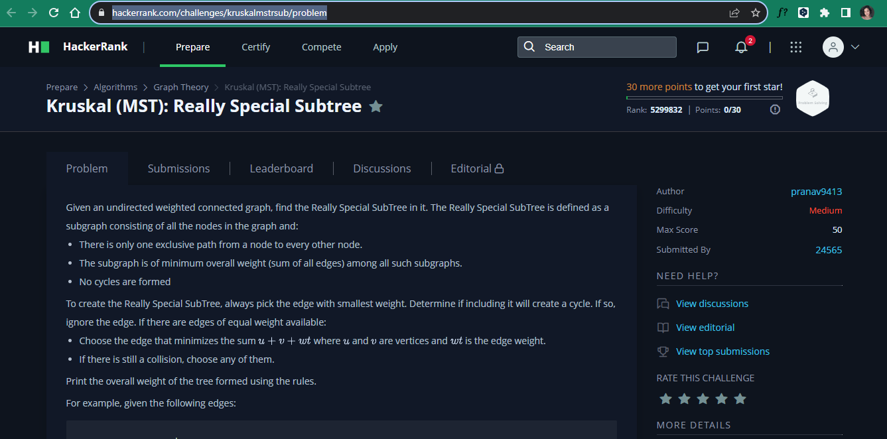
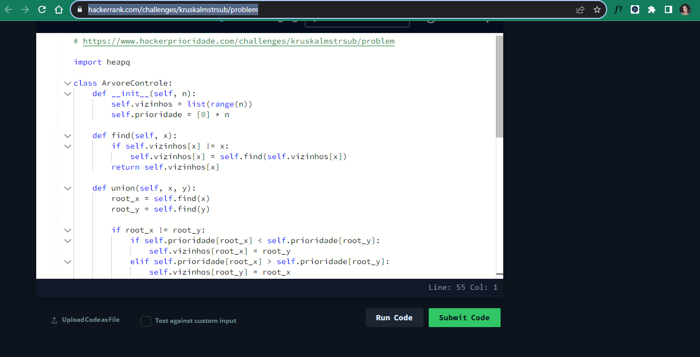
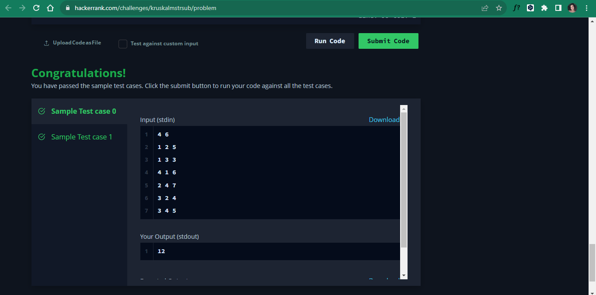
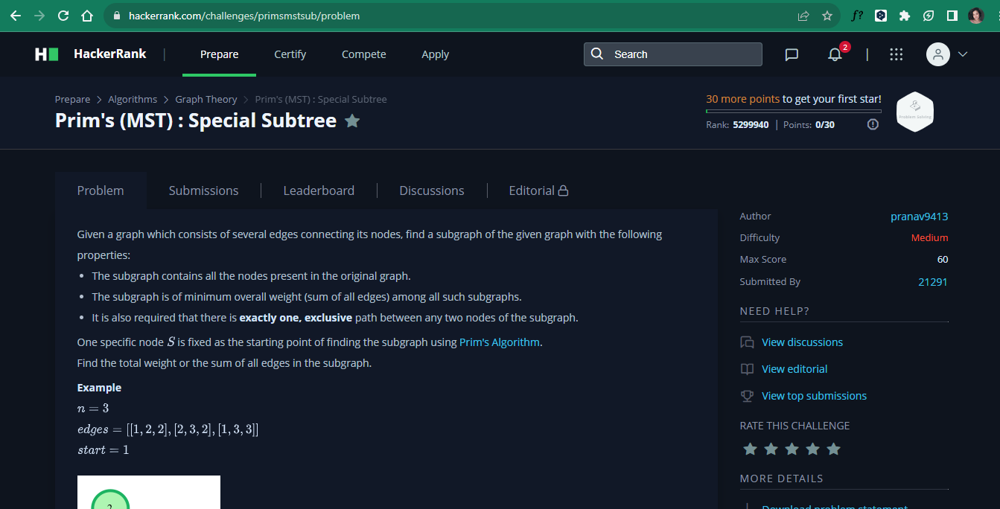
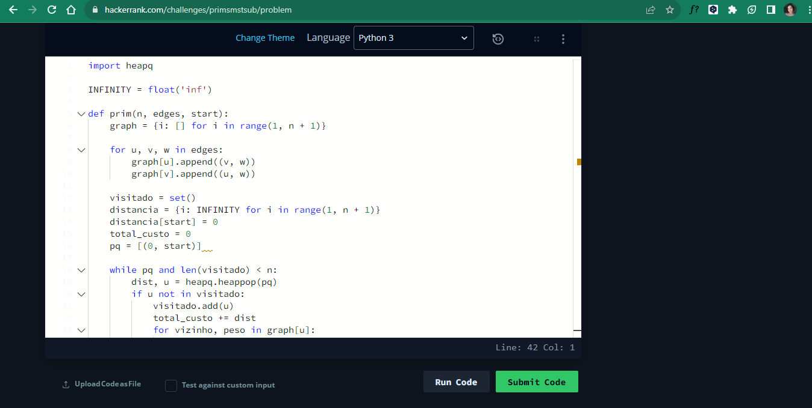
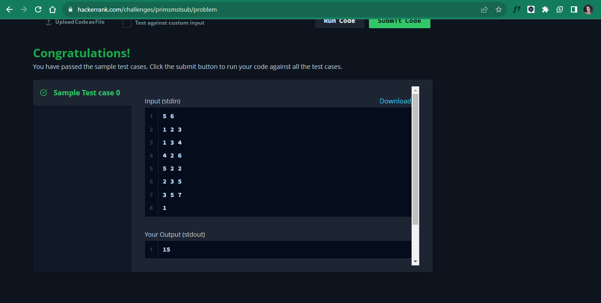

# Exercícios do Juiz Online

**Tema:** Grafos2  
**Número da Lista**: 2 
**Conteúdo da Disciplina**: Dijkstra, Árvore geradora mínima (Prim e Kurskal)  

## Alunos
|Matrícula | Aluno |
| -- | -- |
| 20/0026046  |  Pedro de Oliveira Campos Barbosa |
| 20/2045268  | Raquel Temóteo Eucaria Pereira da Costa|

## Sobre 
Estão presentes neste repositório quatro questões acerca do conteúdo de Grafos 2.

## Screenshots
Adicione 3 ou mais screenshots do projeto em funcionamento.

## Questões
### 1. [Dijkstra](https://leetcode.com/problems/minimum-weighted-subgraph-with-the-required-paths/description/)

### 2. [Kruskal](https://www.beecrowd.com.br/judge/pt/problems/view/1152)

### 3. [Kruskal](https://www.hackerrank.com/challenges/kruskalmstrsub/problem)

### 4. [Prim](https://www.hackerrank.com/challenges/primsmstsub/problem)

## Instalação 
**Linguagem**: Python 

## Uso 
- Clone o repositório em sua máquina
- Certifique-se que tenha o python 3.9.x ou superior instalado
- Basta executar -> python <nome_exercio>.py
- E em seguida preencher o prompt com os casos de teste presentes no repositorio

